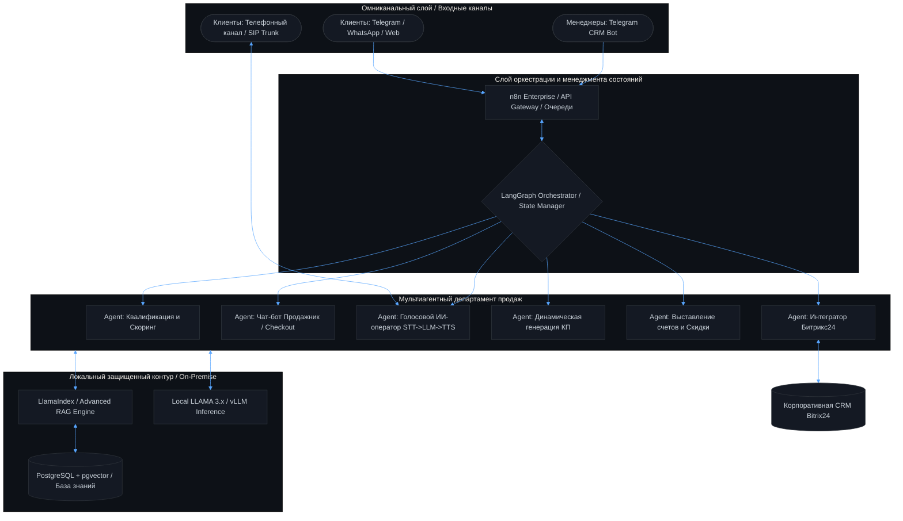

# Вячеслав Квочкин | AI Architect & Lead MAS Engineer 

🚀 Full-Cycle AI-архитектор мультиагентных систем (MAS) и основатель ИТ-компании **Lotus Digital Agents**. Специализируюсь на проектировании децентрализованных "звездных" архитектур и отказоустойчивых автономных конвейеров (Action-oriented AI) корпоративного уровня. Более 10 лет в веб-разработке, последние 3 года — исключительно в сфере сквозной AI-автоматизации, Enterprise RAG и многоагентного взаимодействия. Перевожу искусственный интеллект из режима текстового «консультанта» в режим полностью автономного «исполнителя» бизнес-задач. ---

### 🛠 Профессиональный технологический стек

#### 🔹 Core & Languages

     

#### 🔹 AI & Multi-Agent Frameworks

    
  

#### 🔹 Local LLM & Inference Pool (On-Premise)

  
  
  

#### 🔹 Orchestration & Infrastructure

    

#### 🔹 CRM & Omnichannel Integrations

  
     

---

### 📐 Эталонная архитектура омниканального AI-отдела продаж полного цикла (MAS-AI-Sales)

В рамках проекта **MAS-AI-Sales** реализуется полностью автономный закрытый контур многоагентных систем, оркеструющих воронку продаж от первого касания в любом канале до автоматического закрытия сделки и выставления счета. Система развернута в защищенном локальном контуре (On-Premise) на базе российских стандартов безопасности данных.

#### 🧩 Функциональные роли агентов внутри MAS:

* **Агент квалификации и скоринга:** Извлекает сущности (BANT-методология) из диалогов, определяет боли, бюджет и готовность к покупке, автоматически приоритизируя лид в CRM. * **Чат-бот Продажник (Sales-Agent):** Ведет клиента по воронке, обрабатывает сложные возражения, используя корпоративную базу знаний через **LlamaIndex RAG**, доводит до этапа сделки. * **Голосовой робот (Voice AI Agent):** Интегрирован с SIP-телефонией, осуществляет холодный/теплый обзвон, распознает речь (STT), генерирует ответ через локальную LLM с минимальной задержкой (Low-Latency Inference) и синтезирует естественный голос (TTS).
* **Агент генерации КП:** На основе данных квалификации автоматически собирает кастомное коммерческое предложение в PDF под конкретный запрос клиента и отправляет в чат. * **Финансовый агент:** Реализует триггерную логику отправки персональных скидок для догрева, генерирует платежные ссылки и автоматически выставляет счета через API платежных шлюзов.
* **CRM Bot (Битрикс24):** Синхронизирует состояния агентов с CRM, двигает карточки сделок, ставит задачи и мгновенно тегает живых менеджеров через Telegram-бот в случае необходимости перехвата диалога. #### 🛡 Технологический базис суверенного контура (Self-Hosted):

1. **LangGraph + n8n:** n8n выступает в роли масштабируемого API-шлюза для работы с вебхуками мессенджеров, CRM и генерации документов, а LangGraph управляет сложными циклическими графами, контекстом (State) и цепочками рассуждений агентов. 2. **Local LLAMA & vLLM:** Все вычисления производятся внутри компании. Модели семейства Llama развернуты на собственных GPU-серверах с использованием высокопроизводительного движка vLLM, что исключает отправку конфиденциальных данных клиентов за рубеж.
2. **LlamaIndex + PostgreSQL (pgvector):** Полноценная RAG-архитектура для мгновенного поиска по терабайтам внутренних регламентов, прайс-листов и технических документов. ---

### 📈 Избранные кейсы и подтвержденный бизнес-эффект

#### 🏛 Enterprise RAG-MAS проверки экспертизы | Холдинг «Ровер Групп»

* **Архитектура:** Мультиагентная RAG-система сквозного аудита нормативно-технической документации. * **Реализация:** Построен конвейер полного цикла: интеллектуальное извлечение данных из документов ➡️ векторизация ➡️ гибридный поиск по базе знаний ➡️ генерация объяснимых аргументированных ответов для аудиторов. * **Метрики:** Точность ответов системы **превысила средний уровень экспертов-оценщиков** компании по внутренним тестам, а время проверки кейсов сократилось в разы. #### 📊 NL2SQL BI-надстройка над корпоративными СУБД
* **Архитектура:** Главный агент-оркестратор на базе n8n принимает бизнес-запросы на естественном языке, транслирует их в валидный сложный SQL к базе данных и визуализирует результат. * **Реализация:** Автоматическая генерация аналитических графиков и диаграмм без участия человека. * **Метрики:** Снижение операционной нагрузки на команду аналитики за счет автоматизации 80% типовых отчетов для топ-менеджмента. ---

### 🎓 Образование и квалификация

* **Профильное высшее:** ФГБОУ ВО "Уфимский государственный нефтяной университет" — *09.03.03 Прикладная информатика*. * **Специализированное:** АНО ВПО "Университет Иннополис" — *Архитектор в области искусственного интеллекта*. * **Аналитическое:** МГТУ "Станкин" — *Аналитика — искусство управлять данными*. ---

### 📫 Контакты для связи

* **Email:** [data.guru@ya.ru]() / [app.data.guru@gmail.com]() * **Telegram:** [@dataguru_ai](https://t.me/dataguru_ai)
* **Статус:** Рассматриваю амбициозные Enterprise-предложения (уровень **Lead AI Architect / Team Lead MAS** в компаниях экосистемы **СБЕР**) и архитектурный консалтинг для крупного бизнеса.

---
